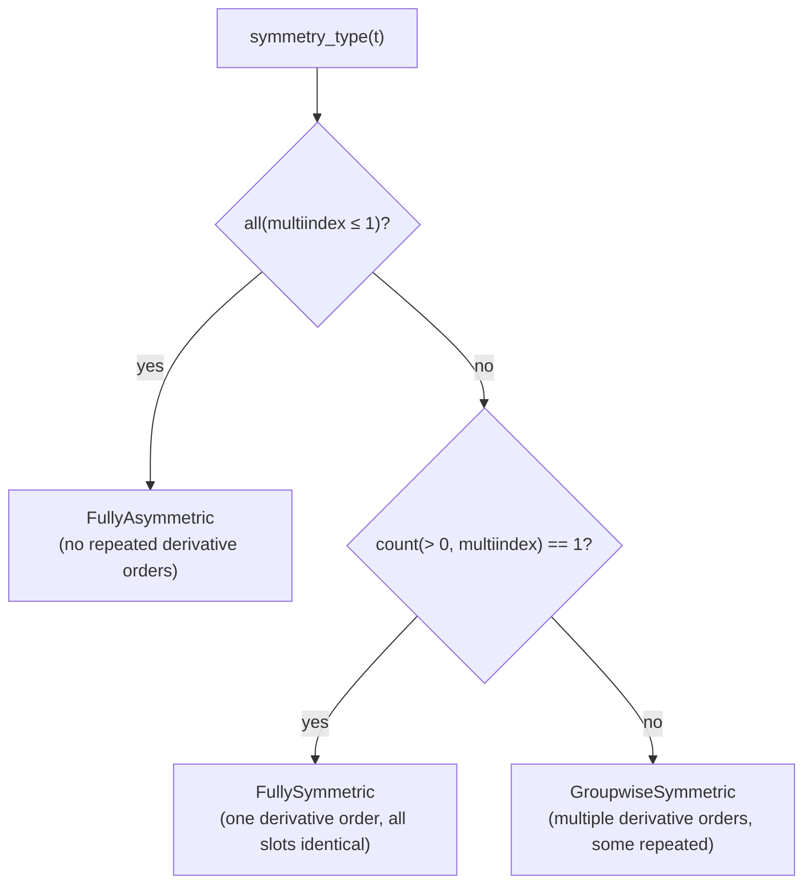
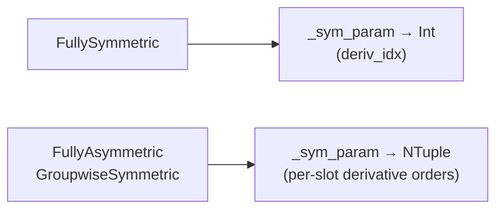
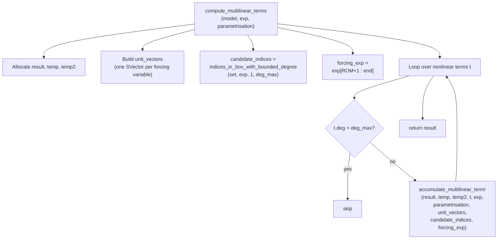
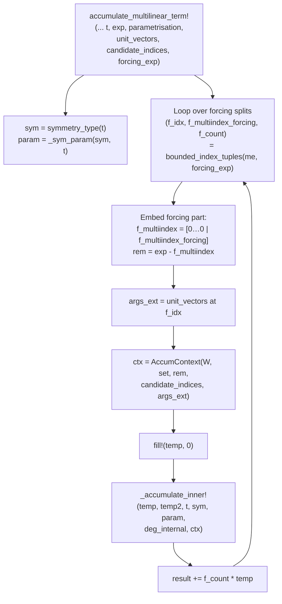
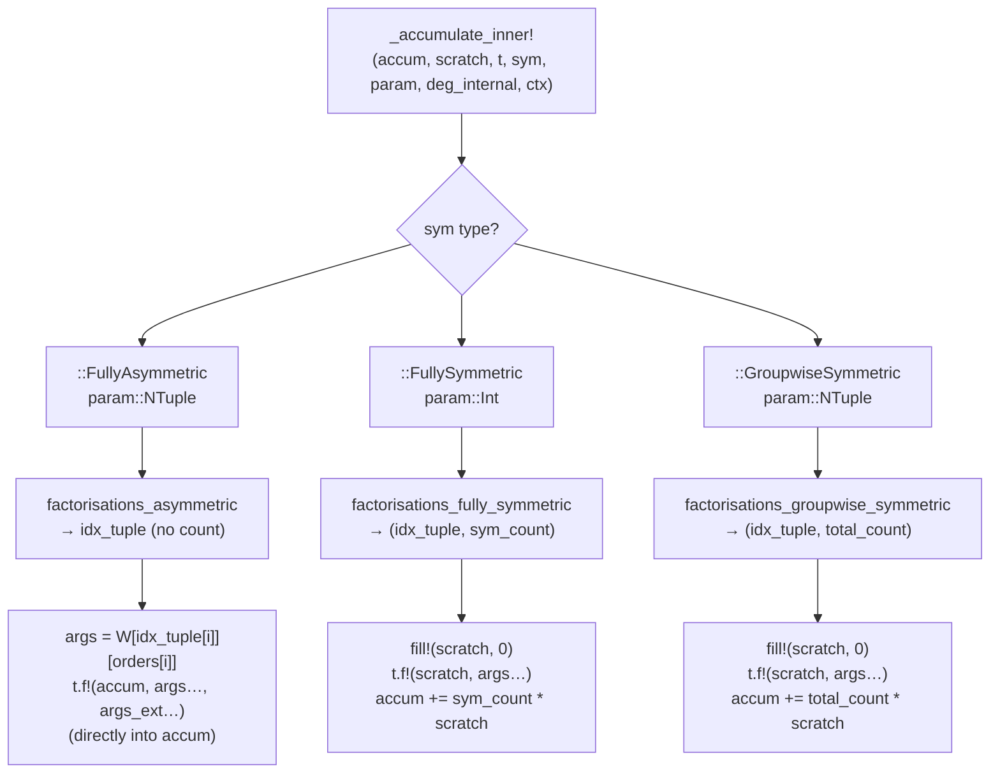

# `MultilinearTerms` — Design & Implementation Documentation

## Table of Contents

1. [Purpose and context](#1-purpose-and-context)
2. [Mathematical background](#2-mathematical-background)
   - 2.1 [The parametrisation ansatz](#21-the-parametrisation-ansatz)
   - 2.2 [The coefficient equations](#22-the-coefficient-equations)
   - 2.3 [What this module computes](#23-what-this-module-computes)
3. [Key data structures](#3-key-data-structures)
   - 3.1 [Exponent vector layout](#31-exponent-vector-layout)
   - 3.2 [MultilinearMap and its multiindex](#32-multilinearmap-and-its-multiindex)
   - 3.3 [AccumContext](#33-accumcontext)
4. [The forcing split](#4-the-forcing-split)
5. [Symmetry classification](#5-symmetry-classification)
   - 5.1 [Why symmetry matters](#51-why-symmetry-matters)
   - 5.2 [FullyAsymmetric](#52-fullyasymmetric)
   - 5.3 [FullySymmetric](#53-fullysymmetric)
   - 5.4 [GroupwiseSymmetric](#54-groupwisesymmetric)
   - 5.5 [Classification logic](#55-classification-logic)
6. [Call graph and control flow](#6-call-graph-and-control-flow)
   - 6.1 [Top-level flow](#61-top-level-flow)
   - 6.2 [Per-term flow](#62-per-term-flow)
   - 6.3 [Dispatch chain](#63-dispatch-chain)
7. [Scratch buffer strategy](#7-scratch-buffer-strategy)
8. [Worked example](#8-worked-example)
9. [Design decisions and architecture](#9-design-decisions-and-architecture)
10. [Debugging](#10-debugging)

---

## 1. Purpose and context

`MultilinearTerms` is a computational kernel in the **parametrisation method** for nonlinear model order reduction. Its single public function is:

```julia
result = compute_multilinear_terms(model, exp, parametrisation)
```

Given a full-order model (a system of ODEs with polynomial nonlinearities), a **target exponent vector** `exp`, and a partially-computed parametrisation polynomial `W`, it returns the vector in state space obtained by evaluating every nonlinear term of the model at the polynomial coefficients of `W` that are consistent with `exp`.

This result appears as a right-hand-side contribution in the **homological equation** that determines the next coefficient of `W`.

---

## 2. Mathematical background

### 2.1 The parametrisation ansatz

Consider an ORD-th order ODE in $\mathbb{R}^n$:

$$B_{\text{ORD}}\, x^{(\text{ORD})} + \cdots + B_1\, \dot{x} + B_0\, x = F(x, \dot{x}, \ldots, x^{(\text{ORD}-1)}, r)$$

where $r \in \mathbb{R}^s$ is a vector of **external forcing variables** with their own autonomous dynamics $\dot{r} = g(r)$.

The parametrisation method seeks a polynomial map

$$W : (\mathbf{z},\, r) \;\longmapsto\; (x,\, \dot{x},\, \ldots,\, x^{(\text{ORD}-1)})$$

from reduced coordinates $\mathbf{z} \in \mathbb{C}^m$ and forcing variables $r \in \mathbb{C}^s$ to the full state, such that the image of $W$ is an invariant manifold of the full-order dynamics.

$W$ is expanded as a multivariate polynomial in **NVAR = m + s** variables:

$$W(\mathbf{z}, r) = \sum_{\alpha \in \mathcal{A}} W_\alpha \cdot \mathbf{z}^{\alpha_z} r^{\alpha_r}$$

where $\alpha = (\alpha_z,\, \alpha_r) \in \mathbb{N}^{m+s}$ is a multiindex, $W_\alpha \in \mathbb{R}^{n \times \text{ORD}}$ are the unknown coefficients (stored as an `SVector{ORD, Vector{T}}`), and $\mathcal{A}$ is the multiindex set.

The coefficient $W_\alpha[k]$ gives the contribution of monomial $\alpha$ to the $(k-1)$-th derivative of $x$.

### 2.2 The coefficient equations

Invariance of the manifold under the flow generates an equation for each exponent $\alpha$. Schematically:

$$\underbrace{\mathcal{L}(W_\alpha)}_{\text{linear operator on } W_\alpha} = \underbrace{N_\alpha(W_{|\beta| < |\alpha|})}_{\text{nonlinear RHS from lower-order coefficients}}$$

The nonlinear right-hand side $N_\alpha$ is a sum over all **multilinear nonlinear terms** $t$ in the model, each evaluated at combinations of lower-order coefficients $W_\beta$ whose multiindices $\beta$ sum to $\alpha$.

**This module computes $N_\alpha$.**

### 2.3 What this module computes

For a single multilinear term $t$ of degree $d = d_{\text{int}} + m_e$, with:
- $d_{\text{int}}$ **internal** factor slots (consuming reduced-coordinate/forcing exponent budget), and
- $m_e$ **external** forcing slots (consuming forcing exponent budget via unit vectors),

and with multiindex $\mu = (\mu_0, \mu_1, \ldots, \mu_{\text{ORD}-1})$ recording how many slots belong to each derivative order, the contribution to the result at exponent $\alpha$ is:

$$\sum_{\substack{\beta \,\in\, \text{ForcingSplit}(\alpha_r,\, m_e)}} f(\beta) \sum_{\substack{(\alpha_1,\ldots,\alpha_{d_{\text{int}}}) \\ \alpha_1 + \cdots + \alpha_{d_{\text{int}}} = \alpha - \hat{\beta}}} \!\!\!\! c(\alpha_1,\ldots,\alpha_{d_{\text{int}}}) \cdot t\!\left(W_{\alpha_1}[\text{ord}_1],\;\ldots,\;W_{\alpha_{d_{\text{int}}}}[\text{ord}_{d_{\text{int}}}],\; e_{\beta_1},\ldots,e_{\beta_{m_e}}\right)$$

where:

| Symbol | Meaning |
|--------|---------|
| $\beta$ | a way to assign the $m_e$ forcing slots to forcing variable unit vectors |
| $f(\beta)$ | multinomial count for that assignment |
| $\hat{\beta}$ | $\beta$ embedded back into $\mathbb{N}^{\text{NVAR}}$ (zeros in the reduced-coord positions) |
| $\alpha_1 + \cdots + \alpha_{d_{\text{int}}}$ | a factorisation of the remainder $\alpha - \hat{\beta}$ |
| $c(\cdot)$ | symmetry multiplicity of the factorisation |
| $\text{ord}_i$ | the derivative order consumed by factor slot $i$ |
| $e_j$ | the $j$-th standard basis vector in $\mathbb{R}^s$ |

---

## 3. Key data structures

### 3.1 Exponent vector layout

The exponent vector `exp` has `NVAR = ROM + forcing_size` components, partitioned as:

```
exp = [ α_z₁  α_z₂  ···  α_z_ROM | α_r₁  α_r₂  ···  α_r_s ]
       \___________ ROM ___________/ \_______ forcing_size ____/
         reduced coordinates              forcing variables
```

This layout is enforced by the type `SVector{NVAR}` and by the binding of `NVAR` in the signatures of both `compute_multilinear_terms` and `accumulate_multilinear_term!`. It is also consistent with `Parametrisation{ORD, NVAR}`.

The forcing slice is extracted **once** at the top level:

```julia
ROM         = NVAR - forcing_size
forcing_exp = ntuple(i -> exp[ROM + i], forcing_size)
```

### 3.2 MultilinearMap and its multiindex

A `MultilinearMap{ORD}` encodes one nonlinear term:

| Field | Meaning |
|-------|---------|
| `f!` | in-place multilinear function; **increments** (never overwrites) its first argument |
| `multiindex` | `NTuple{ORD, Int}` — entry $k$ = number of factor slots using derivative order $k$ |
| `deg` | total degree = `sum(multiindex) + multiplicity_external` |
| `multiplicity_external` | number of external forcing slots $m_e$ |

**Example.** A term with `multiindex = (2, 1)` and `multiplicity_external = 0` in a second-order system ($\text{ORD}=2$) represents a trilinear map that receives two copies of $x$ (derivative order 1) and one copy of $\dot{x}$ (derivative order 2):

$$t(x_1,\, x_2,\, \dot{x}_1) \quad\text{with slot orders } (1, 1, 2)$$

The helper `_derivative_orders(t)` expands `multiindex` into a per-slot tuple of derivative orders:

```
multiindex = (2, 1)  →  _derivative_orders = (1, 1, 2)
multiindex = (1, 1)  →  _derivative_orders = (1, 2)
multiindex = (0, 3)  →  _derivative_orders = (2, 2, 2)
```

### 3.3 AccumContext

`AccumContext` is a small immutable struct that bundles the four arguments that vary across the **forcing-split loop** but are constant within a single `_accumulate_inner!` call:

```julia
struct AccumContext{W, S, R, CI, AE}
    W                 # parametrisation coefficients
    set               # multiindex set
    rem               # exp - f_multiindex  (the remainder to factorise)
    candidate_indices # pre-filtered index superset (shared, from top level)
    args_ext          # tuple of unit vectors for the forcing slots
end
```

Bundling these into one value reduces every `_accumulate_inner!` signature from nine arguments to five, with no heap allocation (all fields are either immutable values or references that already exist).

---

## 4. The forcing split

Before any factorisation over internal indices can happen, the $m_e$ **external forcing slots** must be assigned to forcing variables. This is the outer loop inside `accumulate_multilinear_term!`.

`bounded_index_tuples(me, forcing_exp)` enumerates every way to write $m_e$ ordered slot assignments from forcing variables such that the total forcing degree does not exceed `forcing_exp`. Each iteration yields `(f_idx, f_multiindex_forcing, f_count)`:

- `f_idx` — which forcing variable each of the $m_e$ external slots is assigned to
- `f_multiindex_forcing` — the resulting multiset degree on the forcing variables (length = `forcing_size`)
- `f_count` — multinomial coefficient for this assignment

The forcing multiindex is then embedded into the full `NVAR`-dimensional space by prepending `ROM` zeros:

```julia
f_multiindex = SVector(ntuple(i -> i <= ROM ? 0 : f_multiindex_forcing[i - ROM], Val(NVAR)))
rem          = exp - f_multiindex
```

`rem` is the exponent budget that remains for the $d_{\text{int}}$ internal factor slots. Only reduced-coordinate entries of `rem` can be non-zero (the forcing entries are fully consumed by `f_multiindex`).

```
exp      = [ α_z₁  ···  α_z_m | α_r₁  ···  α_r_s ]
f_multi  = [  0    ···    0   | β_r₁  ···  β_r_s ]
                                ↑___ from forcing split
rem      = [ α_z₁  ···  α_z_m | α_r₁-β_r₁ ··· ]
           \___ consumed by internal factorisations __/
```

---

## 5. Symmetry classification

### 5.1 Why symmetry matters

A multilinear map $t$ of degree $d$ is symmetric under permutation of factor slots that carry the **same derivative order**. When enumerating factorisations $(\alpha_1,\ldots,\alpha_d)$ of `rem`, many distinct ordered tuples yield identical values of $t(W_{\alpha_1}[\text{ord}_1], \ldots)$ because $t$ is symmetric in repeated slots.

Instead of summing over all ordered tuples and evaluating $t$ once each, the code enumerates only the **distinct unordered multisets** within each symmetry group and weights each by its multiplicity count. This is both faster and numerically cleaner.

The multiplicity structure depends entirely on `multiindex`:

### 5.2 FullyAsymmetric

**Condition:** all entries of `multiindex` are $\leq 1$, i.e. each derivative order appears **at most once**.

**Consequence:** all factor slots have **distinct** derivative orders, so there is no symmetry within any group. Each ordered factorisation is counted exactly once, and `t.f!` can accumulate directly into `temp` without a scratch buffer or any scaling.

**Example:** `multiindex = (1, 1)` → a bilinear term in $x$ and $\dot{x}$.

```
Factorisations of rem = (2, 0):
  slot 1 (x-part)   ← α₁ = (1,0)
  slot 2 (ẋ-part)   ← α₂ = (1,0)

  slot 1 (x-part)   ← α₁ = (2,0)
  slot 2 (ẋ-part)   ← α₂ = (0,0)   [only if (0,0) ∈ set]
  ...
```

No multiplicity count needed: `t.f!(accum, W[α₁][1], W[α₂][2])` is called directly.

### 5.3 FullySymmetric

**Condition:** exactly **one** entry of `multiindex` is positive (and $> 1$).

**Consequence:** all $d_{\text{int}}$ factor slots draw from the **same** derivative order `deriv_idx`. The factorisation enumerates unordered multisets $\{\alpha_1, \ldots, \alpha_{d_{\text{int}}}\}$ with replacement, each weighted by `sym_count` = the multinomial coefficient $d_{\text{int}}! / \prod_k m_k!$ where $m_k$ is the multiplicity of index $\alpha_k$ in the multiset.

**Example:** `multiindex = (0, 2)` → a symmetric bilinear term $t(\dot{x}_1, \dot{x}_2)$ (fluid drag).

```
Factorisations of rem = (2, 0) into two ẋ-slots:
  {(2,0), (0,0)}   sym_count = 2   (the pair is ordered in 2! / 1!1! = 2 ways)
  {(1,0), (1,0)}   sym_count = 1   (both copies are identical: 2! / 2! = 1)
```

Result: `temp += sym_count * t.f!(W[α₁][2], W[α₂][2])`.

### 5.4 GroupwiseSymmetric

**Condition:** **multiple** entries of `multiindex` are positive, with at least one $> 1$.

**Consequence:** factor slots form two or more groups by derivative order, with symmetry **within** each group. The `total_count` returned by `factorisations_groupwise_symmetric` accounts for both the within-group multinomial coefficient and the between-group combinatorial factor.

**Example:** `multiindex = (2, 1)` → $t(x_1, x_2, \dot{x})$ where the two $x$-slots are symmetric.

```
Factorisations of rem = (3, 0) into (x₁, x₂, ẋ):
  x-group: {(2,0),(1,0)},  ẋ-group: {(0,0)}
      total_count = [ways to assign x-slots] × [ways to assign ẋ-slots]
                  = (2!/1!1!) × 1 = 2
  x-group: {(3,0),(0,0)},  ẋ-group: {(0,0)}
      total_count = (2!/1!1!) × 1 = 2
  ...
```

### 5.5 Classification logic



The asymmetric check is tested first: a term with `multiindex = (1,)` (a single entry of value 1) satisfies both conditions, but it is correctly — and cheaply — routed to `FullyAsymmetric`.

Once the symmetry tag is known, `_sym_param` extracts the branch-specific constant that `_accumulate_inner!` needs, using Julia's multiple dispatch rather than an `isa` check:



---

## 6. Call graph and control flow

### 6.1 Top-level flow



`candidate_indices`, `unit_vectors`, and `forcing_exp` are computed **once** and shared by all terms, avoiding repeated work inside the hot term loop.

### 6.2 Per-term flow



### 6.3 Dispatch chain

`_accumulate_inner!` has three methods, specialised at **compile time** by Julia's dispatch on the `SymmetryType` tag and the type of `param`:



The `FullyAsymmetric` path is the fastest: it never touches `scratch` and does not scale by a count.

---

## 7. Scratch buffer strategy

Two scratch buffers, `temp` and `temp2`, are allocated once in `compute_multilinear_terms` and reused throughout. Their roles at each nesting level are:

| Buffer | Zeroed at | Used for |
|--------|-----------|----------|
| `temp` | start of each forcing-split iteration | accumulates the contribution of one `(f_idx, f_multiindex)` split across all internal factorisations |
| `temp2` | before each individual `t.f!` call (symmetric/partial branches only) | receives the output of a single `t.f!` evaluation before scaling by the multiplicity count |

The asymmetric branch bypasses both: `t.f!` increments `temp` directly (exploiting the increment contract), and `temp2` is silently ignored (named `_scratch` in the signature to signal this).

```
result          ← Σ_splits  f_count × temp
  temp          ← Σ_factorisations  count × temp2        [symmetric/partial]
    temp2       ← t.f!(W[α₁][ord₁], …, args_ext…)

result          ← Σ_splits  f_count × temp
  temp          ← Σ_factorisations  t.f!(W[α₁][ord₁], …) [asymmetric, no temp2]
```

---

## 8. Worked example

**Setup.** Second-order system ($\text{ORD} = 2$), $n = 2$, $m = 2$ reduced coordinates, $s = 0$ forcing. Consider the symmetric bilinear term:

```julia
function vel_squared!(res, xdot1, xdot2)
    @. res += 0.5 * xdot1 * xdot2
end
t = MultilinearMap(vel_squared!, (0, 2))
# multiindex = (0, 2):  zero x-slots, two ẋ-slots
# deg = 2,  multiplicity_external = 0
# symmetry_type → FullySymmetric
# _sym_param → deriv_idx = 2  (the single positive entry is at position 2)
```

**Parametrisation.** Linear part only; mode shapes $\varphi_1 = [1,0]^\top$, $\varphi_2 = [0,1]^\top$ with eigenvalues $\lambda_{1,2} = -0.1 \pm 2i$:

$$W_{(1,0)} = \begin{pmatrix} \varphi_1 \\ \lambda_1 \varphi_1 \end{pmatrix}, \qquad W_{(0,1)} = \begin{pmatrix} \varphi_2 \\ \lambda_2 \varphi_2 \end{pmatrix}$$

All higher-order coefficients are zero.

**Target exponent.** $\alpha = (2, 0)$, so $\text{deg\_max} = 2$.

**Step 1 — Forcing split.** $m_e = 0$, so there is exactly one split: $\beta = ()$ (empty), $f_\text{count} = 1$, $\text{rem} = (2, 0)$.

**Step 2 — Factorisations of rem = (2,0) into two ẋ-slots** (via `factorisations_fully_symmetric`):

| Multiset $\{\alpha_1, \alpha_2\}$ | sym_count |
|-----------------------------------|-----------|
| $\{(1,0),\,(1,0)\}$ | $1$ ($= 2!/2!$, both slots identical) |
| $\{(2,0),\,(0,0)\}$ | $2$ ($= 2!/1!1!$, two distinct slots) |

However, $W_{(0,0)} = 0$ (it is the constant term, which is zero in a parametrisation centred at the origin). So only the first factorisation contributes.

**Step 3 — Accumulation** for $\{\alpha_1, \alpha_2\} = \{(1,0),(1,0)\}$, `sym_count = 1`:

$$\text{temp} \mathrel{+}= 1 \times t\!\left(W_{(1,0)}[2],\; W_{(1,0)}[2]\right) = 1 \times \text{vel\_squared!}\!\left(\lambda_1 \varphi_1,\; \lambda_1 \varphi_1\right)$$

$$= \tfrac{1}{2}\,(\lambda_1 \varphi_1) \odot (\lambda_1 \varphi_1) = \tfrac{1}{2}\,\lambda_1^2\,\begin{pmatrix}1 \\ 0\end{pmatrix}$$

**Step 4 — Scaling.** $f_\text{count} = 1$, so:

$$\text{result} \mathrel{+}= 1 \times \text{temp} = \tfrac{1}{2}\lambda_1^2\,\varphi_1$$

With $\lambda_1 = -0.1 + 2i$: $\lambda_1^2 = -3.99 - 0.4i$, so $\tfrac{1}{2}\lambda_1^2 \approx (-1.995 - 0.2i)\,\varphi_1$. ✓

---

## 9. Design decisions and architecture

### Multiple dispatch instead of `isa` branching

The original code computed both `orders` (an `NTuple`) and `deriv_idx` (an `Int`) unconditionally, using one as a sentinel value of `nothing`/`0`. The refactored code replaces this with two dispatched helpers:

```julia
_sym_param(::FullySymmetric, t) → Int        # only what FullySymmetric needs
_sym_param(::SymmetryType,   t) → NTuple     # only what the others need
```

Julia's dispatch then selects the correct `_accumulate_inner!` specialisation at **compile time**, with zero runtime cost and no dead code paths in any branch.

### Hoisting shared precomputations

All quantities that depend only on `exp` and the parametrisation — not on the specific term `t` or the forcing split — are computed **once** at the top level and threaded down as arguments:

| Quantity | Computed in | Shared across |
|----------|-------------|---------------|
| `candidate_indices` | `compute_multilinear_terms` | all terms, all forcing splits |
| `unit_vectors` | `compute_multilinear_terms` | all terms, all forcing splits |
| `forcing_exp` | `compute_multilinear_terms` | all terms |

This means the inner loops perform **no heap allocation**.

### `AccumContext` reduces argument list width

Passing seven loosely-related values as positional arguments makes signatures fragile and hard to extend. Bundling them into `AccumContext` gives each `_accumulate_inner!` method a clean five-argument signature, makes the set of per-iteration data explicit, and localises any future changes to the struct definition.

### The `candidate_indices` superset contract

`candidate_indices` is computed from the **full** exponent `exp`, not from the per-split remainder `rem`. This means it is a **superset** of the indices that could appear in any factorisation of any `rem ≤ exp`. The factorisation routines (`factorisations_asymmetric` etc.) perform their own exact filtering against `rem`, so correctness is maintained. The benefit is that the expensive `indices_in_box_with_bounded_degree` call is executed only once per `compute_multilinear_terms` invocation.

---

## 10. Debugging

Structured debug logging is provided via Julia's standard `@debug` macro. It is compiled to a **no-op** at normal log levels and adds zero overhead in production.

To activate for this module only:

```julia
ENV["JULIA_DEBUG"] = "MultilinearTerms"
```

Four log levels are placed at progressively finer granularity:

| Location | Key fields logged |
|----------|------------------|
| `compute_multilinear_terms` entry | `exp`, `deg_max`, `ROM`, `forcing_exp`, `n_terms`, `n_candidates` |
| Per term (before inner call) | `f!`, `deg`, `multiindex`, `multiplicity_external` |
| Per forcing split | `f_idx`, `f_multiindex`, `f_count`, `rem`, `args_ext` |
| Per factorisation (innermost) | `idx_tuple`, multiplicity count (`sym_count` or `total_count`) |

The innermost level (per factorisation) is the most verbose and is useful primarily for validating symmetry counts against manual calculations.